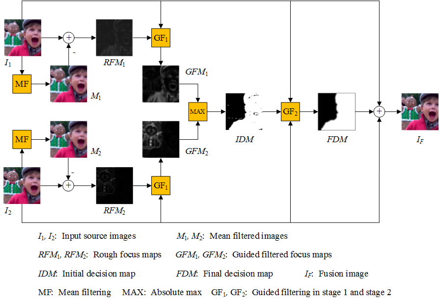

# GFDF: Multi-Focus Images Fusion 
Python implementation of the GFDF algorithm by Qiu et al., 2019

["Guided filter-based multi-focus image fusion through focus region detection"](https://doi.org/10.1016/j.image.2018.12.004)

Using Numpy, OpenCV and Scikit-Image.

To cite the original paper:
```
@article{QIU201935,
  title={Guided filter-based multi-focus image fusion through focus region detection},
  author={Xiaohua Qiu,Min Li,Liqiong Zhang,Xianjie Yuan},
  journal={Signal Processing: Image Communication},
  year={2019},
  publisher={Elsevier}
}
```

## Graphical abstract



## Original implementation (Matlab)
https://github.com/bitname/Multi-focus-image-fusion-GFDF